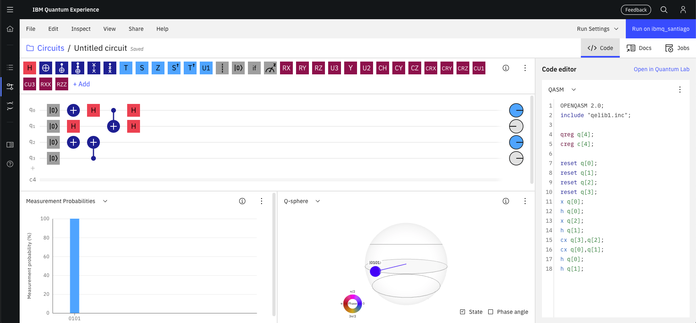

# QuantumRNG - QRNG as a service prototypes



This repo is a prototype for some ideas of having a 'Quantum RNG as a Service' - A cryptographically secure pseudorandom number generator (CSPRNG) that makes use of a quantum computer to generate its entropy pool for its randomness. 

We have chosen to use IBM's [IBM Quantum Experience](https://quantum-computing.ibm.com/) platform due to there being no other cloud Quantum Computing platform with >5 qubits that can be accessed and utilised for free (looking at you, AWS Braket...)

## Disclaimer

This code is most certainly **NOT** for use in production systems. This is just a proof-of-concept designed to show one way to integrate cloud systems into something that has the promise of being useful. We advise you to read the code and understand what is being proposed before deploying it. 

## Getting It Working

If you don't have one already, you will need to register an account on the [IBM Quantum Experience](https://quantum-computing.ibm.com/) website. 

You will need to install `qiskit` with `pip` or sim in order for you to access the quantum computer backend. 

You will also need to create an `ibm_secrets.yml` file so that you can load in your API key (look at the 'My Account' page on IBMQX to find this).

The contents of this should look like:
```
ibm_api_key: long_hexadecimal_string_goes_here
```

(Note - you can specify a file when you call the class, so long as it contains the right YAML key.)

Once you have set this up, then you should be good to go by running the qrng flask API with
```
python3 qrng_flask_api.py
```

You can test it with the following `curl` examples. This should return 512 bits, base64 encoded, in a JSON object:
```
curl http://127.0.0.1:5000/api/v1/qrng/get_bits
```
Whilst this should return a specified number of bits, base64 encoded in a JSON object. 
```
curl http://127.0.0.1:5000/api/v1/qrng/get_num_bits/1024
```

We can add additional endpoints to return fixed formats of random bits as required, but these are the two most basic functions required by most things that want to access good quality randomness.

## Future work 

This is an ongoing research project and we have four areas we feel the code can be built upon as TODOs:
 * Add HTTPS certs for TLSv1.2/1.3 secure communications
 * Add auth
 * Proper real world testing
 * Add threading for high-volume applications

We are releasing this to the community in the hope that it fosters creativity and pull requests. 

# Who Is Behind It?

QuantumRNG was developed by the Dr. Mark Carney [@LargeCardinal](https://twitter.com/LargeCardinal) of Santander Cyber Security Research 

